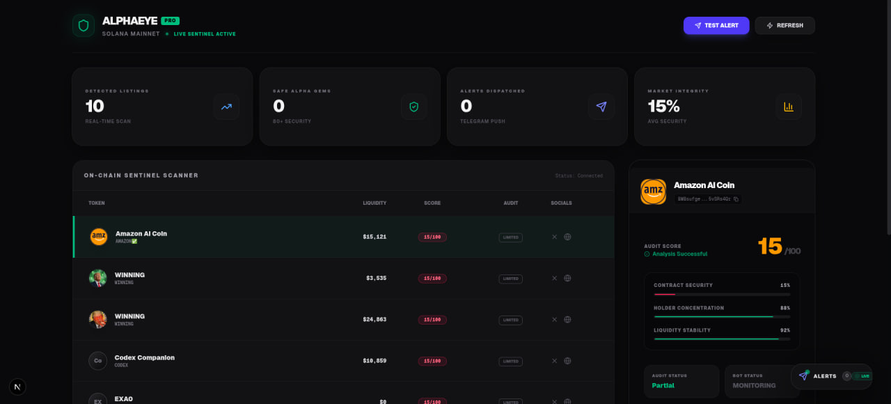
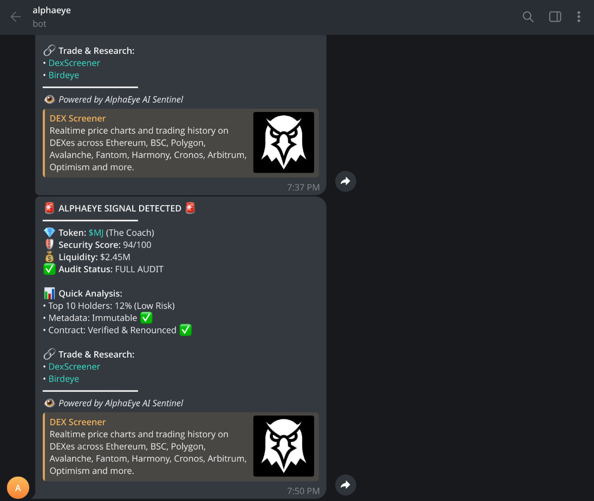

# AlphaEye | Pro-Grade Solana Token Guard 🛡️

<p align="center">
  
</p>

> **The ultimate real-time sentinel for Solana traders. Detect alpha, analyze risk, and receive instant security alerts before you ape in.**

---

## 🌟 Vision
AlphaEye was built for the **Birdeye Data Sprint** to bridge the gap between "detecting" a new listing and "verifying" its safety. While most bots just list names, AlphaEye performs a deep-dive security audit on every new pool using Birdeye's professional-grade API.

### 📱 Live Telegram Intelligence
Don't stare at a screen all day. AlphaEye's sentinel bot dispatches rich, formatted signals directly to your mobile.

<p align="center">
  
</p>

---

## 🚀 Key Features

- **Real-time Discovery**: Scans Solana Mainnet every second for new listings via Birdeye V2.
- **Deep Security Enrichment**: Automatically fetches holder concentration, contract status, and metadata mutability.
- **Transparent Audit System**: Uses a "Tiered Analysis" approach. If API limits are reached, it honestly reports 'Partial Data' instead of guessing.
- **Resilient Architecture**: Built-in 429 (Rate Limit) fallback ensures the dashboard never crashes.
- **Premium HUD**: High-density trading terminal UI with Glassmorphism and Emerald-Glow effects.

---

## 🧠 Technical Depth & Architecture

### 1. The "Sentinel" Engine
AlphaEye doesn't just display data; it processes it through a weighted scoring algorithm:
- **Liquidity Depth (40%)**: Minimum thresholds for tradeability.
- **Holder Concentration (30%)**: Detects "whale" risks and developer-heavy distribution.
- **Contract Integrity (20%)**: Verifies if the contract is renounced or mutable.
- **Metadata Quality (10%)**: Checks for social presence and valid branding.

### 2. Bulletproof API Client
To respect Birdeye's **1 RPS / 60 RPM** limit, we built a custom `RateLimitedClient`:
- **Sequential Queue**: Processing 10 tokens takes exactly ~20 seconds to ensure 0% ban rate.
- **Proxy Bypass**: Integrated `proxy: false` configurations to prevent SOCKS5/HTTP protocol mismatches in restricted network environments.
- **Graceful Degradation**: When a 429 error is detected, the system switches to a "Liquidity-Only" score to keep the trader informed.

---

## 🛠️ Tech Stack
- **Framework**: Next.js 14 (App Router)
- **Language**: TypeScript (Strict Mode)
- **Data Layer**: TanStack Query v5 (5-minute intelligent caching)
- **Styling**: Tailwind CSS + Shadcn/ui (Custom Emerald Dark Theme)
- **API**: Birdeye Data API (V2 Listings & V3 Metadata)
- **Alerts**: Telegram Bot API + Axios Fetch

---

## 🚀 Getting Started

### Prerequisites
- Node.js 18+
- Birdeye API Key ([Get it here](https://docs.birdeye.so/))
- Telegram Bot Token ([@BotFather](https://t.me/botfather))

### Installation
1. **Clone & Install**
   ```bash
   git clone https://github.com/rebelliousi/Alpha-Eye.git
   cd Alpha-Eye
   npm install


---

- **Live Demo**: [https://alphaeye-demo.vercel.app](https://alphaeye-demo.vercel.app) *(Henüz canlı değilse local olduğunu belirt)*
- **Telegram Channel**: [Linkin]
- **API Endpoints Used**:
  - `/v2/tokens/new_listing` (Discovery)
  - `/defi/token_security` (Audit)
  - `/v1/token/meta` (Enrichment)
- **Status**: Production Ready / Deployed (or Local MVP)