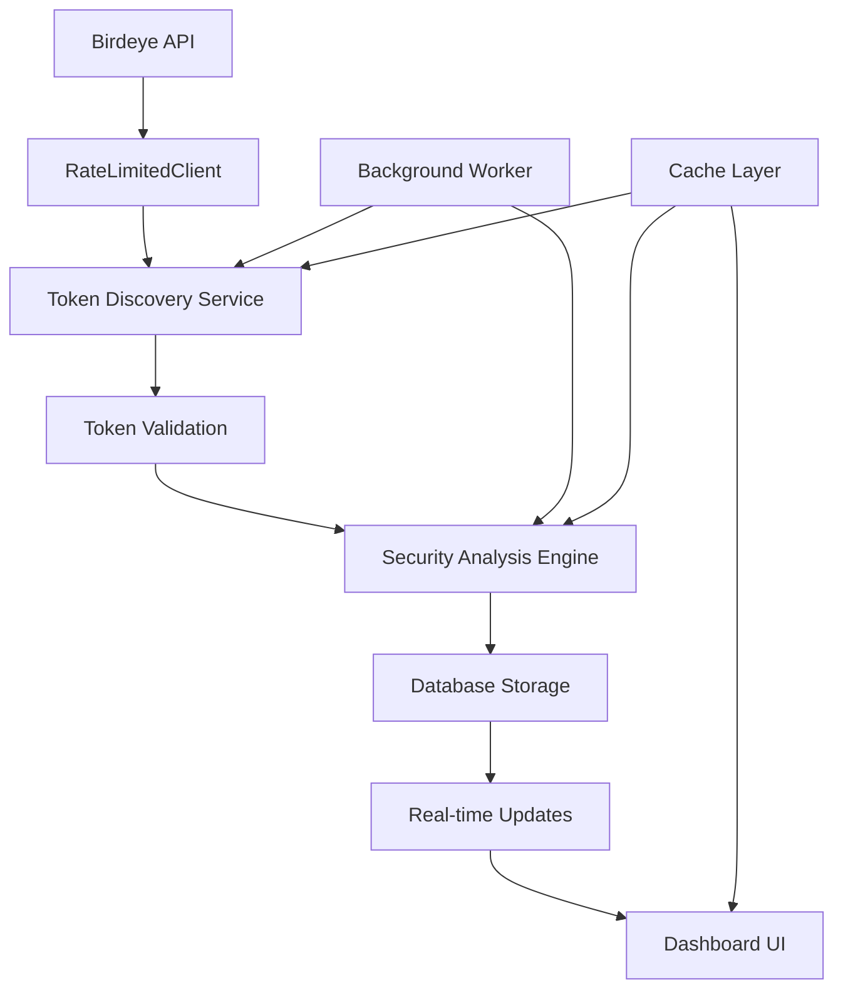

# AlphaEye Projesi Baş Mimari ve Uygulama Planı

## Proje Tanımı
AlphaEye, Birdeye API kullanarak yeni listelenen tokenları taran ve güvenlik analizi yapan bir Dashboard uygulamasıdır.

## 1. Proje Klasör Yapısı

```
alpha-eye/
├── src/
│   ├── app/                    # Next.js App Router
│   │   ├── (dashboard)/
│   │   │   ├── page.tsx       # Ana dashboard
│   │   │   ├── tokens/
│   │   │   │   └── page.tsx   # Token listesi
│   │   │   └── analysis/
│   │   │       └── page.tsx   # Detaylı analiz
│   │   ├── api/
│   │   │   ├── tokens/
│   │   │   │   └── route.ts   # Token API endpoint
│   │   │   └── analysis/
│   │   │       └── route.ts   # Analiz API endpoint
│   │   ├── globals.css
│   │   ├── layout.tsx
│   │   └── page.tsx
│   ├── components/
│   │   ├── ui/                # Shadcn/ui components
│   │   ├── dashboard/
│   │   │   ├── TokenCard.tsx
│   │   │   ├── AnalysisChart.tsx
│   │   │   └── SecurityScore.tsx
│   │   └── layout/
│   │       ├── Header.tsx
│   │       └── Sidebar.tsx
│   ├── lib/
│   │   ├── birdeye/
│   │   │   ├── client.ts      # RateLimitedClient
│   │   │   ├── types.ts       # API tipleri
│   │   │   └── endpoints.ts   # API endpoint'leri
│   │   ├── security/
│   │   │   ├── analyzer.ts    # Güvenlik analizi motoru
│   │   │   └── score.ts       # Skorlama algoritması
│   │   ├── database/
│   │   │   ├── schema.ts      # Veritabanı şeması
│   │   │   └── client.ts      # DB client
│   │   └── utils/
│   │       ├── rate-limiter.ts
│   │       └── cache.ts
│   ├── hooks/
│   │   ├── useTokens.ts       # Token verisi için
│   │   ├── useAnalysis.ts     # Analiz verisi için
│   │   └── useRealTime.ts     # Real-time güncellemeler
│   └── types/
│       ├── token.ts
│       ├── analysis.ts
│       └── api.ts
├── public/
├── prisma/
│   └── schema.prisma
├── package.json
├── next.config.js
├── tailwind.config.js
└── tsconfig.json
```

## 2. Teknoloji Seçimi

### Core Stack
- **Next.js 14+** (App Router) - Server-side rendering ve API routes
- **TypeScript** - Type safety
- **TailwindCSS** - Styling
- **Shadcn/ui** - UI component library

### State Management & Data Fetching
- **TanStack Query (React Query)** - Server state management
- **Zustand** - Client state management (UI state)
- **React Hook Form** - Form handling

### Database & Caching
- **Prisma** - ORM (PostgreSQL)
- **Redis** - Caching ve rate limiting
- **Upstash Redis** - Cloud Redis solution

### Real-time & Monitoring
- **Server-Sent Events** - Real-time token updates
- **WebSocket** - Optional for real-time dashboard

## 3. Rate Limiting Stratejisi

### RateLimitedClient Yapısı

```typescript
// src/lib/birdeye/client.ts
class RateLimitedClient {
  private requestQueue: Array<() => Promise<any>> = [];
  private isProcessing = false;
  private lastRequestTime = 0;
  private requestCount = 0;
  
  // 1 RPS (1 request per second)
  private readonly MIN_INTERVAL = 1000;
  // 60 RPM (60 requests per minute)
  private readonly MAX_REQUESTS_PER_MINUTE = 60;
  
  async request<T>(endpoint: string, options?: RequestOptions): Promise<T> {
    return new Promise((resolve, reject) => {
      this.requestQueue.push(async () => {
        try {
          const result = await this.makeRequest<T>(endpoint, options);
          resolve(result);
        } catch (error) {
          reject(error);
        }
      });
      
      this.processQueue();
    });
  }
  
  private async processQueue() {
    if (this.isProcessing || this.requestQueue.length === 0) return;
    
    this.isProcessing = true;
    
    while (this.requestQueue.length > 0) {
      const now = Date.now();
      const timeSinceLastRequest = now - this.lastRequestTime;
      
      // Rate limiting kontrolü
      if (timeSinceLastRequest < this.MIN_INTERVAL) {
        await this.delay(this.MIN_INTERVAL - timeSinceLastRequest);
      }
      
      // RPM kontrolü
      if (this.requestCount >= this.MAX_REQUESTS_PER_MINUTE) {
        const resetTime = this.lastRequestTime + 60000;
        const waitTime = Math.max(0, resetTime - Date.now());
        await this.delay(waitTime);
        this.requestCount = 0;
      }
      
      const request = this.requestQueue.shift();
      if (request) {
        await request();
        this.lastRequestTime = Date.now();
        this.requestCount++;
      }
    }
    
    this.isProcessing = false;
  }
}
```

### Redis-based Rate Limiting
```typescript
// src/lib/utils/rate-limiter.ts
export class RedisRateLimiter {
  async checkLimit(key: string, limit: number, window: number) {
    const redis = getRedisClient();
    const now = Date.now();
    const windowStart = now - window;
    
    const pipeline = redis.pipeline();
    pipeline.zremrangebyscore(key, 0, windowStart);
    pipeline.zcard(key);
    pipeline.zadd(key, now, now);
    pipeline.expire(key, Math.ceil(window / 1000));
    
    const results = await pipeline.exec();
    const currentCount = results[1][1] as number;
    
    return {
      allowed: currentCount < limit,
      remaining: Math.max(0, limit - currentCount - 1),
      resetTime: now + window
    };
  }
}
```

## 4. Veri Akışı

### Tokens → Security Analysis → Dashboard UI



### Akış Detayları

1. **Token Discovery**
   - Background worker her 5 dakikada bir yeni tokenları tarar
   - RateLimitedClient ile API calls yapılır
   - Yeni tokenlar Redis cache'e yazılır

2. **Security Analysis**
   - Token bilgileri analiz motoruna gönderilir
   - Liquidity, holder distribution, contract audit yapılır
   - Risk skoru (0-100) hesaplanır
   - Sonuçlar veritabanına kaydedilir

3. **Dashboard UI**
   - TanStack Query ile veri çekilir
   - Real-time updates ile yeni tokenlar gösterilir
   - Filtreleme ve sıralama yapılır
   - Detaylı analiz sayfasına erişim

### API Endpoint'leri

```typescript
// API Routes
GET  /api/tokens          // Token listesi (paginated)
GET  /api/tokens/[id]     // Token detayı
POST /api/analysis/[id]   // Analiz başlat
GET  /api/analysis/[id]   // Analiz sonucu
GET  /api/stats           // İstatistikler
```

## 5. Birdeye API Reference Data

### New Listing
```typescript
interface NewListing {
  address: string;           // Token contract address
  symbol: string;            // Token symbol (e.g., "PEPE")
  name: string;              // Token name (e.g., "Pepe Token")
  liquidity: number;         // Liquidity amount in USD
  liquidityAddedAt: string;  // Timestamp when liquidity was added
}
```

### Token Security
```typescript
interface TokenSecurity {
  creatorAddress: string;     // Token creator wallet address
  top10HolderPercent: number; // Percentage held by top 10 holders
  mutableMetadata: boolean;   // Whether metadata can be changed
  jupStrictList: boolean;     // Jupiter strict list status
}
```

### Token Metadata
```typescript
interface TokenMetadata {
  logo_uri: string;          // Token logo URL
  extensions: {
    website?: string;         // Project website
    twitter?: string;         // Twitter handle
    discord?: string;         // Discord invite link
  };
}
```

## 6. Kurallar ve İlkeler

- **WINDSURF.md** projenin anayasasıdır, her adımda referans alınır
- **1 RPS / 60 RPM** RateLimitedClient yapısından asla ödün verilmez
- Tüm API calls mutlaka rate limiting katmanından geçer
- Security analizi her token için zorunludur
- Real-time güncellemeler kullanıcı deneyimini önceler
- Database ve cache katmanları performansı optimize eder
